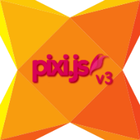

[](http://lib.haxe.org/p/pixijs) [](https://travis-ci.org/pixijs/pixi-haxe)
=========


Externs of Pixi.js v4.x for Haxe - A fast and lightweight 2D javascript rendering library that works across all devices.

### Installation

```
haxelib install pixijs
```

### Issues

Found any bug? Please create a new [issue](https://github.com/pixijs/pixi-haxe/issues/new).

### Demos

* [Basics](http://adireddy.github.io/demos/pixi-haxe/basics.html)
* [Graphics](http://adireddy.github.io/demos/pixi-haxe/graphics.html)
* [Animated Sprite](http://adireddy.github.io/demos/pixi-haxe/animatedsprite.html)
* [Spritesheet](http://adireddy.github.io/demos/pixi-haxe/spritesheet.html)
* [Spine](http://adireddy.github.io/demos/pixi-haxe/spine.html)
* [Rope](http://adireddy.github.io/demos/pixi-haxe/rope.html)
* [Dragging](http://adireddy.github.io/demos/pixi-haxe/dragging.html)
* [Texture Swap](http://adireddy.github.io/demos/pixi-haxe/textureswap.html)
* [Tiling](http://adireddy.github.io/demos/pixi-haxe/tiling.html)
* [Bitmap Font](http://adireddy.github.io/demos/pixi-haxe/bitmapfont.html)
* [Alpha Mask](http://adireddy.github.io/demos/pixi-haxe/alphamask.html)
* [Bunnymark](http://adireddy.github.io/demos/pixi-haxe/bunnymark.html)
* [Retina](http://adireddy.github.io/demos/pixi-haxe/retina.html)
* [Events](http://adireddy.github.io/demos/pixi-haxe/events.html)
* [Loader](http://adireddy.github.io/demos/pixi-haxe/loader.html)
* [Video](http://adireddy.github.io/demos/pixi-haxe/video.html)
* [Nape](http://adireddy.github.io/demos/pixi-haxe/nape.html)
* [Dragon Bones](http://adireddy.github.io/demos/pixi-haxe/dragonbones.html)

**Filters (WebGL only)**

* [ColorMatrix](http://adireddy.github.io/demos/pixi-haxe/colormatrix.html)
* [Blur](http://adireddy.github.io/demos/pixi-haxe/blur.html)

**Filters (pixi-extra-filters)**
* [Glow](http://adireddy.github.io/demos/pixi-haxe/glow.html)

**[COHERE](http://adireddy.github.io/cohere/)** - Sample MVC application using Haxe and Pixi.js

Look at the `samples` folder for the source code of above examples.

### Usage

```haxe

import pixi.plugins.app.Application;
import pixi.core.graphics.Graphics;
import pixi.core.textures.Texture;
import pixi.core.sprites.Sprite;
import js.Browser;

class Main extends Application {

	var _bunny:Sprite;
	var _graphic:Graphics;

	public function new() {
		super();

		position = Application.POSITION_FIXED;
		width = Browser.window.innerWidth;
		height = Browser.window.innerHeight;
		backgroundColor = 0x006666;
		transparent = true;
		antialias = false;
		onUpdate = _animate;
		super.start();

		_bunny = new Sprite(Texture.fromImage("assets/basics/bunny.png"));
		_bunny.anchor.set(0.5);
		_bunny.position.set(400, 300);

		_graphic = new Graphics();
		_graphic.beginFill(0xFF0000, 0.4);
		_graphic.drawRect(200, 150, 400, 300);
		_graphic.endFill();

		stage.addChild(_graphic);
		stage.addChild(_bunny);
	}

	function _animate(e:Float) {
		_bunny.rotation += 0.1;
	}

	static function main() {
		new Main();
	}
}
```

### Licensing Information

<a rel="license" href="http://opensource.org/licenses/MIT">
</a>

This content is released under the [MIT](http://opensource.org/licenses/MIT) License.

[Pixi.js](https://github.com/GoodBoyDigital/pixi.js) is licensed under the [MIT](http://opensource.org/licenses/MIT) License.

### Contributor Code of Conduct

[Code of Conduct](https://github.com/CoralineAda/contributor_covenant) is adapted from [Contributor Covenant, version 1.4](http://contributor-covenant.org/version/1/4)
